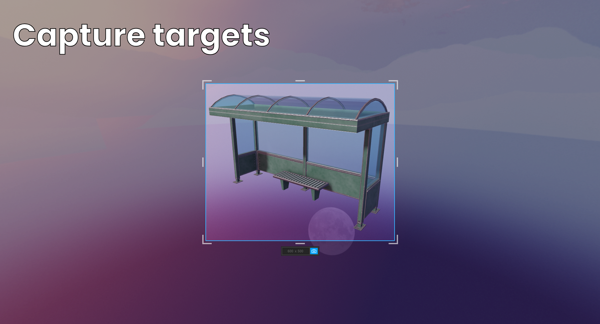
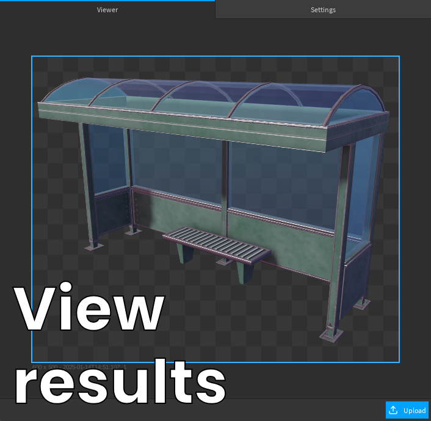
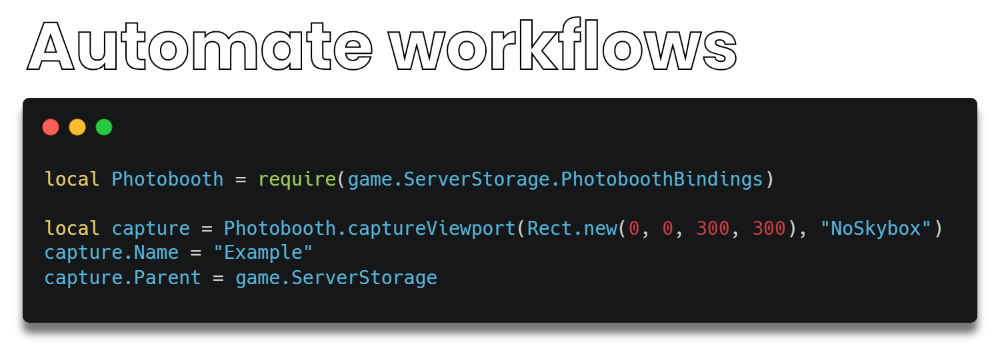

# Photobooth Plugin


This plugin allows you to capture images of the workspace or UI elements entirely in Roblox studio. It features the ability to remove the skybox from images and to upload any captures to Roblox for use as asset ids.

  

[Link here.](https://create.roblox.com/store/asset/82716202460157/Photobooth)

## Bindings

This plugin can be used for automation purposes. An example use case might be capturing icons for all the inventory items in your game thereby allowing you to avoid using viewport frames which are more expensive than traditional images.

To use this feature open the viewer and in the settings menu toggle "Bindings" to `true`.


This will create a `ModuleScript` underneath `ServerStorage` which provides a typed interface that can be used to create automated capture workflows. Included are a couple of common template workflows to get you started.

```luau
local Photobooth = require(game.ServerStorage.PhotoboothBindings)

local capture = Photobooth.captureViewport(Rect.new(0, 0, 300, 300), "NoSkybox")
capture.Name = "Example"
capture.Parent = game.ServerStorage
```

## Saving Captures

If you want to save any of the plugin captures to your computer, you can do so by right clicking the exported mesh part and selecting "Export Selection".


This will prompt you to export the mesh in `.obj` format which will include the texture of the mesh in `.png` format. Both the `.obj` and `.mtl` files can be discarded.


