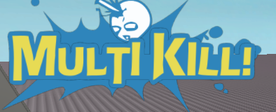
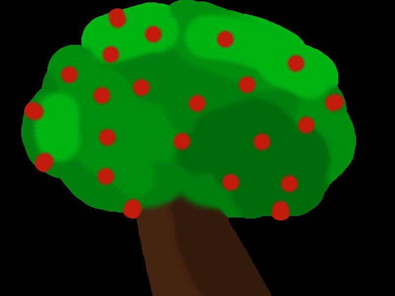
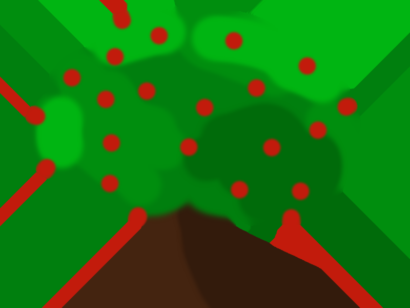

This doc aims to explain the purpose of the alpha bleed setting and what it does.

Roblox uses a technique called bilinear filtering to resize images when they’re not displayed at their original resolution (i.e. bigger or smaller). The algorithm figures out new pixels by using weighted samples from the original image.

Say you had these two pixels beside each other:

Then you wanted to stretch the image to 3 pixels which means you need to generate an interpolated pixel in between these two:

Easy right? Well what if the green pixel was actually fully transparent? It’s still green you just can’t see it.

That doesn’t look right… The interpolation pixel’s color is being impacted by the invisible green pixel which mathematically makes sense, but to the human eye it looks bad.

It should be more like this:

This is the inherent flaw of bilinear filtering as it’s implemented in Roblox.

Often times when a png is saved all the invisible pixels are stored as black to save on memory. However, this often causes ugly black edges on resized images as a result of bilinear filtering:

To fix the issue we find all the fully invisble pixels in an image and bleed their visible neighbors into it.

Take this image (imagine the black pixels are fully transparent):

Becomes...

All that is to say Photobooth does this for you automatically when you have the alpha bleed setting enabled! It’s on by default b/c it ultimately leads to a more flexible image. However, as you noticed it is slow especially for large images.

My recommendation for power-users would be to disable it for these high resolution shots and then use a tool like [chipng](https://devforum.roblox.com/t/2783037) which can do the alpha bleeding much faster, but outside of Roblox.