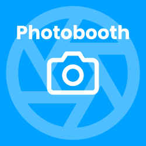
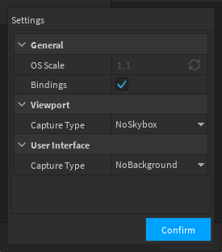
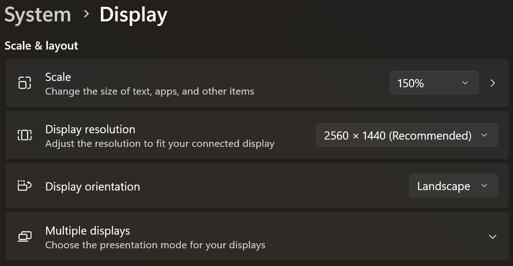
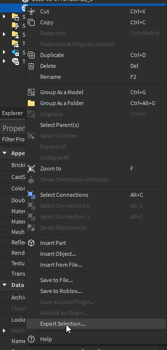
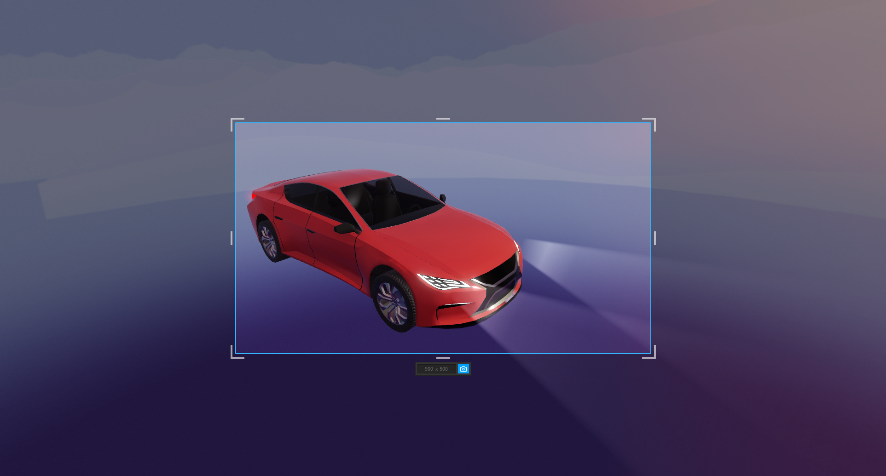
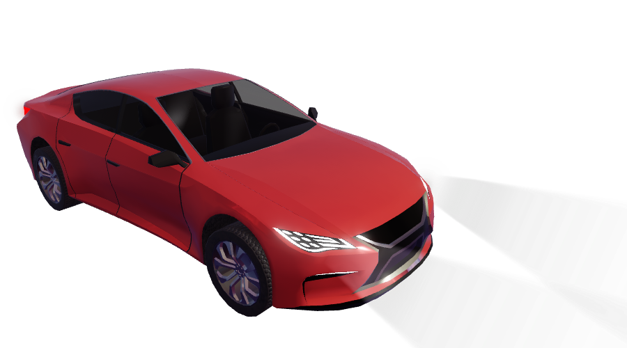
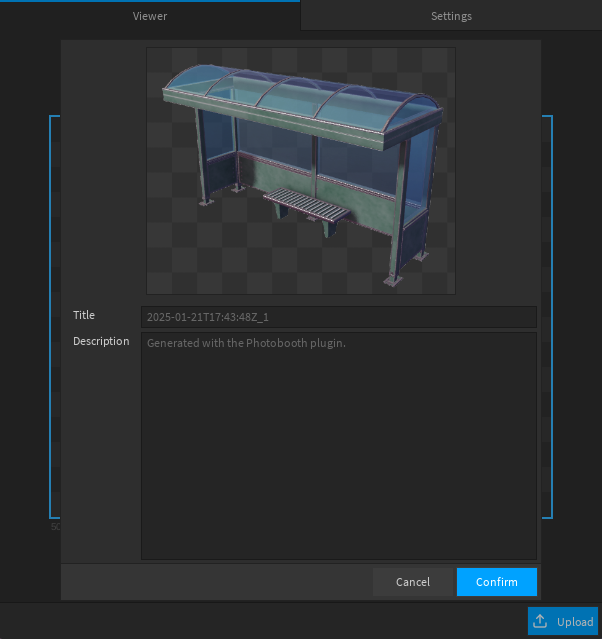
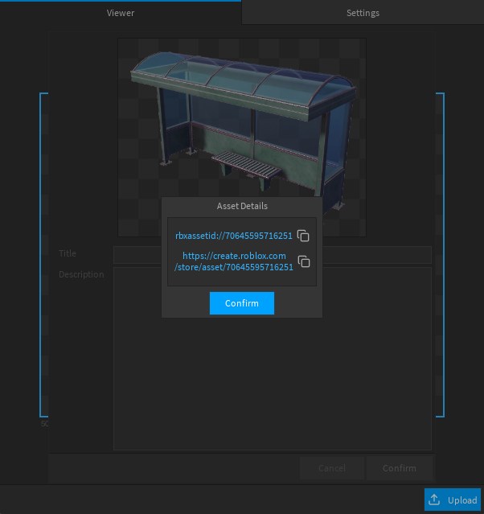

# Photobooth



Photobooth is a plugin that allows you to capture images of the workspace or UI elements entirely in Roblox studio.

Notably, it features the ability to remove skyboxes/backgrounds from images and bindings to allow developers to write their own capture workflows.

Results are output as editable images stored in a mesh part's texture.

Get the plugin [here.](https://create.roblox.com/store/asset/82716202460157)

## Limitations

Photobooth has a couple of limitations specific to the skybox removal preset. For most users these will likely not be of significant impact, but I'm listing them here so people can see them before purchase.

General:
- No capture can be larger than 1024 x 1024 since that's the limit of editable images.
- Photobooth can only be used during edit mode in studio. It cannot be used to capture anything during a studio play session.

Skybox removal:
- No atmosphere / fog support.
- Anything that cannot be frozen in place on screen is not supported. For example:
	- Terrain grass.
	- Force-field material.
- Certain configurations of color correction such as `Brightness > 0` and / or `Contrast < 0`.
- Retro color grading is highly recommended for best results, but not mandatory.

Bindings:
- See the OS scaling section below

**Warning: This plugin will cause the screen to flash when removing skyboxes. Those with photosensitive epilepsy are advised caution when using this plugin.**

## Bindings

This plugin can be used for automation purposes. An example use case might be capturing icons for all the inventory items in your game thereby allowing you to avoid using viewport frames which are more expensive than traditional images.

To use this feature open the viewer and in the settings menu toggle "Bindings" to `true`.



This will create a `ModuleScript` underneath `ServerStorage` which provides a typed interface that can be used to create automated capture workflows. Included are a couple of common template workflows to get you started.

```luau
local Photobooth = require(game.ServerStorage.PhotoboothBindings)

local capture = Photobooth.captureViewport(Rect.new(0, 0, 300, 300), "NoSkybox")
capture.Name = "Example"
capture.Parent = game.ServerStorage
```

### OS scaling

With the advent of high resolution monitors many computers use scaling options built into their operating system to ensure that applications rendered on screen are not too small. Roblox however, always captures in full resolution leading to a number of UX problems.

Photobooth will attempt to resolve this issue automatically, but for the highest quality image when using bindings it is strongly recommended to use your monitor's true resolution.



*i.e. use scale 100% and the display resolution that matches your monitor.*

## Saving Captures as PNGs

If you want to save any of the plugin captures to your computer, you can do so by right clicking the exported mesh part and selecting "Export Selection".



This will prompt you to export the mesh in `.obj` format which will include the texture of the mesh in `.png` format. Both the `.obj` and `.mtl` files can be discarded.





## Uploading

**This feature is currently disabled!**

Uploading will be enabled in the future once Roblox provides the proper security tooling to allow creator store plugins to upload assets on your behalf. More detail from Roblox [here.](https://devforum.roblox.com/t/beta-lua-asset-creation-for-creator-tooling-with-createassetasync/3294134)

For now, developers will have to write their own code to upload editable images.

```luau
local ATTRIBUTE_NAME = "UploadResult"

local AssetService = game:GetService("AssetService")
local SelectionService = game:GetService("SelectionService")

for _, selected in SelectionService:Get() do
	if selected:IsA("MeshPart") and not selected:GetAttribute(ATTRIBUTE_NAME) then
		local content = selected.TextureContent
		local object = content and content.Object

		if object and object:IsA("EditableImage") then
			local result, value = AssetService:CreateAssetAsync(object, Enum.AssetType.Image, {
				Name = selected.Name,
				Description = "",
				IsPackage = false,
			})

			if result == Enum.CreateAssetResult.Success then
				selected:SetAttribute(ATTRIBUTE_NAME, `rbxassetid://{value}`)
			end
		end
	end
end
```

When this feature is enabled this is what the upload process will look like:




