# OS Scaling

With the advent of high resolution monitors many computer users use scaling options built into their operating system to ensure that applications rendered on screen are not too small.

This introduces some interesting challenges to the photobooth plugin which will be discussed here.

## What is it?

When Roblox captures a screenshot it does so at the real resolution.


For example, on windows if you scaled your display by 150% you'd find that when Roblox captured an image of size 100 x 100 you'd get a result of 150 x 150.

To be clear, the result is not being upscaled. Instead, Roblox is just flat out lying to about what the actual size of things are.

To see this more clearly, let's see full desktop screenshots of a 100 x 100 square with different scaling, but on the same monitor.

| 100% scaling | 150% scaling |
| ------------- | ------------- |
| 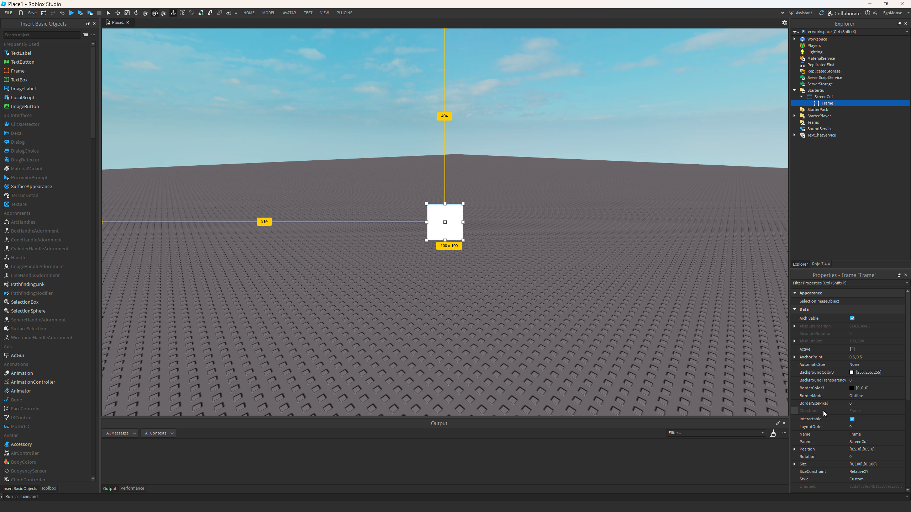 | 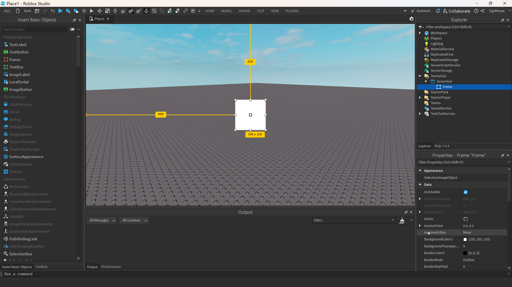 |

Even though Roblox tells us both these squares are the same size, they're clearly not rendered as such.

In a way this is good news, it means captures will always be in the highest quality possible. The bad news is that the concept of OS scaling can be difficult to convey to the user and leads to UX problems.

## How it's handled

When the plugin is initialized it takes a capture of the screen to get the real dimensions and then compares them to the viewport size. This scale value is then used for the rest of the session, although it can be recalculated by the user through the settings menu.

### Viewport

Capturing the viewport is more a UX problem than a technical one. The plugin shows the user the real size of the lense as opposed to the dimensions Roblox would provide. This ensures no loss of quality and the ability to use as much of the viewport as possible.

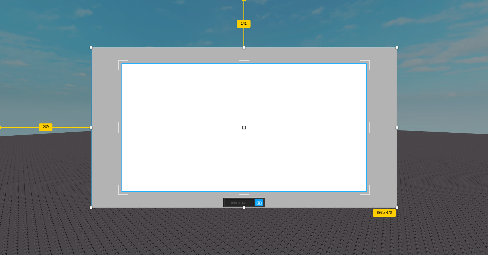
*OS Scaling is 125%*

### User Interface

To capture UI a SurfaceGui with the "FixedSize" SizingMode is used to convert the UI to its real size. This requires the SurfaceGui to be rendered on a surface that matches the viewport size.

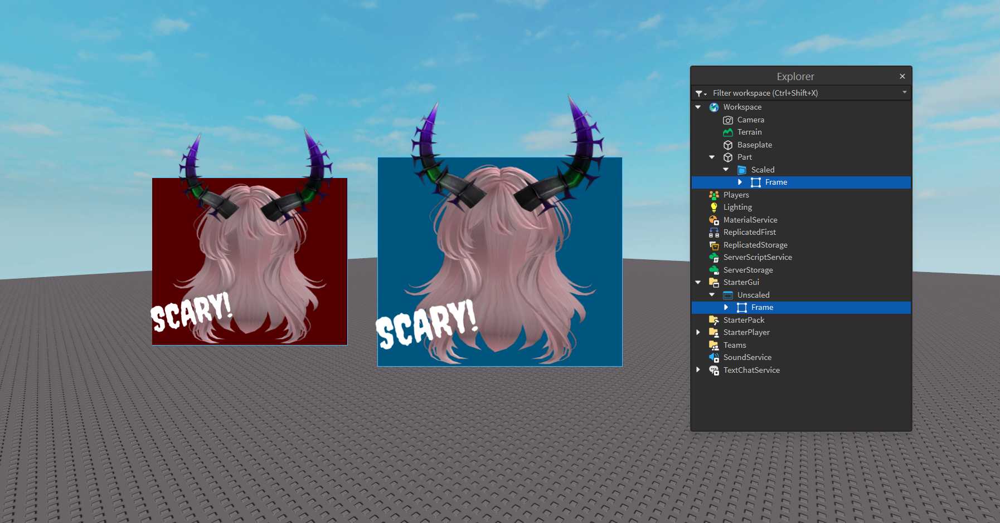
*OS Scaling is 125% - Red: Real Size, Blue: Unmodified*


```luau
local function scaledSurfaceGui(scale: Vector2)
	local camera = workspace.CurrentCamera
	local viewportSize = camera.ViewportSize
	local aspect = viewportSize.X / viewportSize.Y
	local distance = 0.5 / math.tan(math.rad(camera.FieldOfView / 2))

	local surfacePart = Instance.new("Part")
	surfacePart.Transparency = 1
	surfacePart.Anchored = true
	surfacePart.CFrame = camera.CFrame * CFrame.new(0, 0, -(distance + 0.5))
	surfacePart.Size = Vector3.new(aspect, 1, 1)
	surfacePart.Parent = workspace

	local surfaceGui = Instance.new("SurfaceGui")
	surfaceGui.AlwaysOnTop = true
	surfaceGui.Face = Enum.NormalId.Back
	surfaceGui.SizingMode = Enum.SurfaceGuiSizingMode.FixedSize
	surfaceGui.CanvasSize = viewportSize * scale
	surfaceGui.Adornee = surfacePart
	surfaceGui.Parent = surfacePart
end
```

### Bindings

This is the trickiest case to handle. The UI binding can work exactly the same as above so that's a non-issue, but the viewport binding is a whole other story.

The user passes the `rect` they want to capture, but that `rect` is not relative of the real size of the viewport. The resulting image will be larger than what the user requested which brings about a slew of UX problems and errors.

So how is this handled?

To answer that we need to review the following CFrame:

```luau
-- w = width [0, 1]
-- h = height [0, 1]
-- dx = width [-0.5, 0.5]
-- dy = height [-0.5, 0.5]
-- dz = zoom > 0
-- m = max(abs(w, h, dx, dy, dz))

CFrame.new(0, 0, 0,
	w / m, 0, 0,
	0, h / m, 0,
	dx / m, dy / m, dz / m
)
```

Multiplying this CFrame against the camera's current CFrame lets us crop the rendered camera viewport.

|               |               |               |
| ------------- | ------------- | ------------- |
| 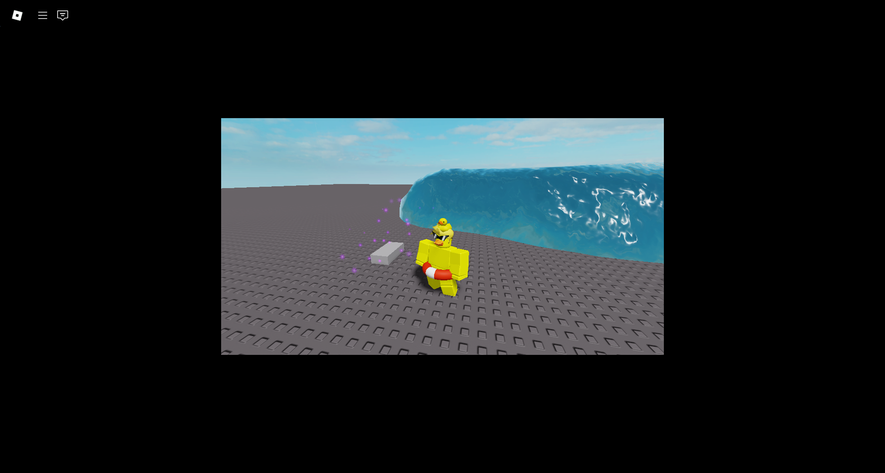 | 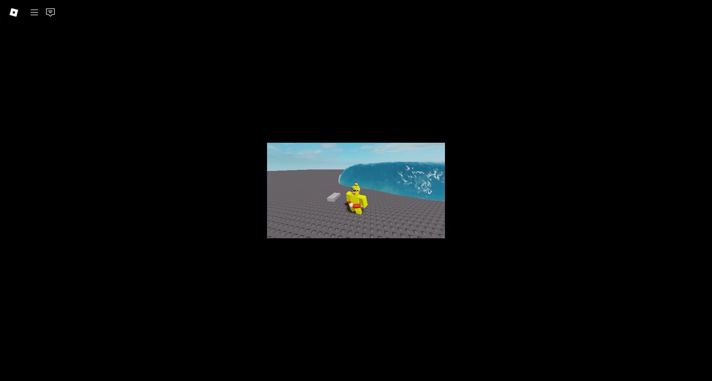 | 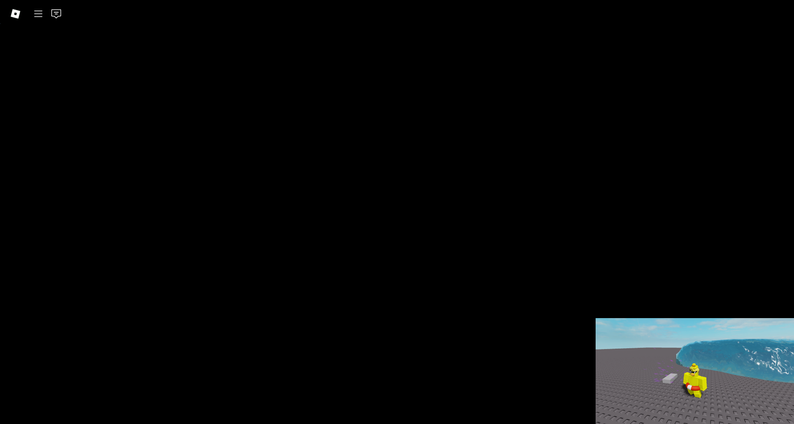 |
| 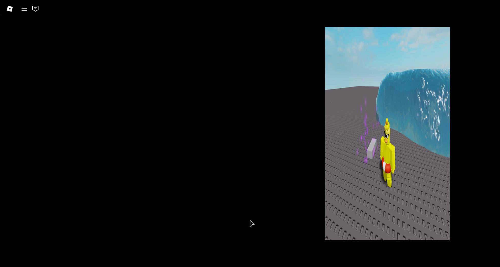 | 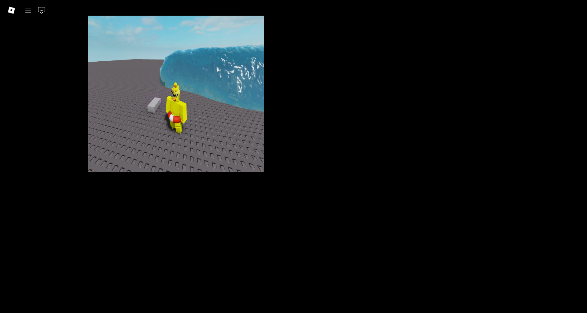 |  |


This technique can be used to scale the viewport during a capture which lets us adjust what's rendered to its real size.

**Caveats**

Unfortunately, this technique is not a perfect solution. For example, it does not play well with the water shader:

| 100% scaled | 50% scaled | 200% scaled |
| ------------- | ------------- | ------------- |
| 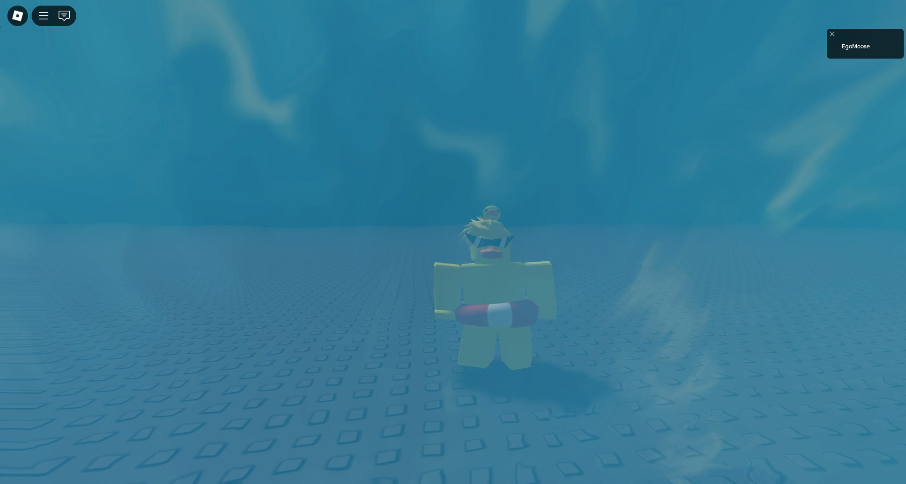 | 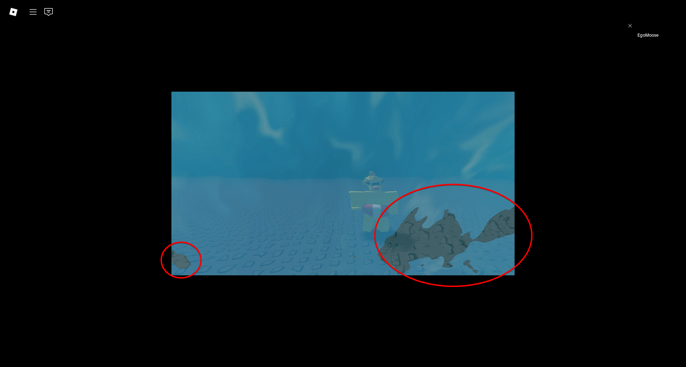 | 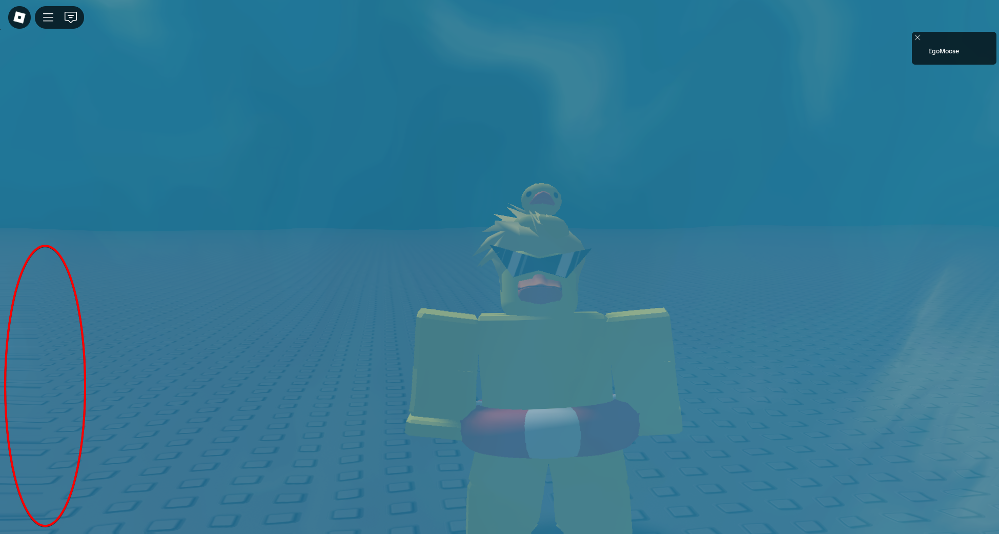 |

That being said, the artifacts and anomalies caused by this method are few and far between. Even though there are flaws with this approach it's still the best balance between UX and quality I was able to find.

***Ultimately, it is highly recommended to use bindings only when OS scaling is at 100%***

## Other techniques?

A few other proposals that weren't discussed here:

### Downscale the captures

After a capture is taken it would be possible to use something like bilinear filtering to downscale the image.

```luau
local editImage = captureEditableImage()
local osScale = editImage.Size / workspace.CurrentCamera.ViewportSize

editImage:DrawImageTransformed(Vector2.zero, 1 / osScale, 0, editImage, {
	CombineType = Enum.ImageCombineType.Overwrite,
	SamplingMode = Enum.ResamplerMode.Default, -- Bilinear Interpolation
	PivotPoint = Vector2.zero,
})
```

This is great from a UX perspective, but results in a loss of quality which defeats is something this plugin tries to avoid.

### Don't do anything!

This is also a valid approach. Asking the user to scale the input `rect` themselves may be an acceptable requirement depending on who you ask. In the context of this plugin, I disagree with this approach.