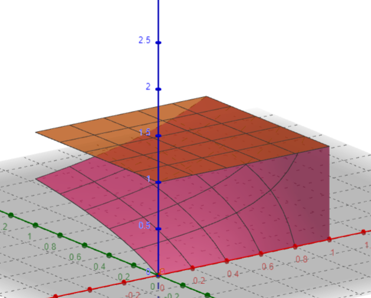
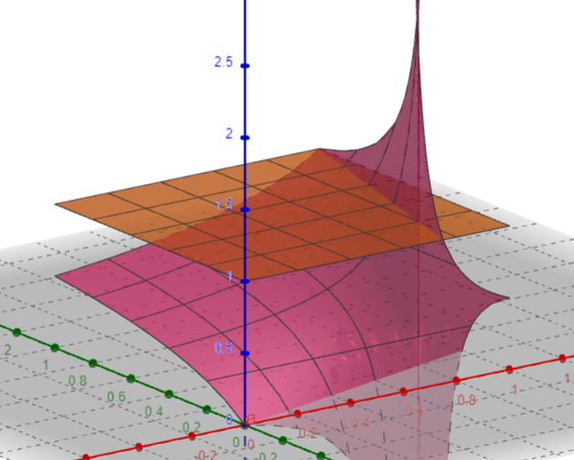
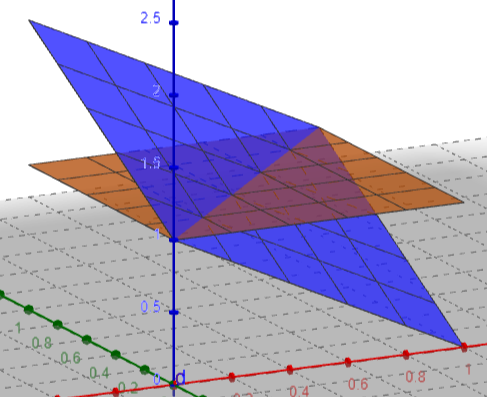
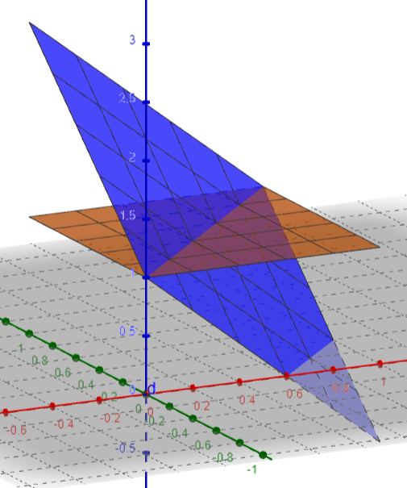

# Reverse Blending

This file acts as a explanation of the method used by the plugin for removing backgrounds (i.e. skyboxes) from images.

## Setup

Pixel A over pixel B can be composited using the following [equations](https://en.wikipedia.org/wiki/Alpha_compositing):

```math
\alpha_{o}=\alpha_{a}+\alpha_{b}(1-\alpha_{a})
```

```math
K_{o}={\frac{K_{a}\alpha_{a}+K_{b}\alpha_{b}(1-\alpha_{a})}{\alpha_{o}}}
```

We can assume that both the background (B) and the output image (O) are fully opaque. Thus $\alpha_{b}=1$ and $\alpha_{o}=1$

We can use this to simplify and rearrange the RGB calculation:

```math
\begin{align*}
K_{o}&=K_{a}\alpha_{a} + K_{b}(1 - \alpha_{a}) \\
K_{o}&=K_{b} - \alpha_{a}(K_{b} - K_{a}) 
\end{align*}
```

For $\alpha_{a}$:
```math
\alpha_{a} = \frac{K_{o} - K_{b}}{K_{a} - K_{b}}
```

For $K_{a}$:

```math
K_{a} = K_{b} + \frac{K_{o} - K_{b}}{\alpha_{a}}
```

This is not enough information to solve for either $K_{a}$ or $\alpha_{a}$, but if we had multiple samples we could form a system of equations:

## Constraining the blend equations

Say we have:

```
B = Black background
W = White background
```

Then we can set up the following equalities and rearrange.

For $\alpha_{a}$:

```math
\begin{align*}
B_{b} + \frac{B_{o} - B_{b}}{\alpha_{a}} &= W_{b} + \frac{W_{o} - W_{b}}{\alpha_{a}} \\
\alpha_{a} &= \frac{W_{b} - W_{o} + B_{o} - B_{b}}{W_{b} - B_{b}}
\end{align*}
```

For $K_{a}$:

```math
\begin{align*}
\frac{B_{o} - B_{b}}{K_{a} - B_{b}} &= \frac{W_{o} - W_{b}}{K_{a} - W_{b}} \\ 
K_{a} &= \frac{W_{b}B_{o} - B_{b}W_{o}}{B_{o} - B_{b} + W_{b} - W_{o}}
\end{align*}
```

## What backgrounds to pick?

One question you might ask is what backgrounds should we capture the image on? Earlier black and white were picked, but is that the optimal choice?

To answer this, lets map out the function in 3D (we're assuming the inputs range between [0, 1], but this all holds true if you use [0, 255] as well)

```math
f(W_{o}, B_{o}) = \frac{W_{b}B_{o} - B_{b}W_{o}}{B_{o} - B_{b} + W_{b} - W_{o}}
```

By playing around with the $W_{b}$ and $B_{b}$ values we'll quickly find that only when we have pure black and white backgrounds do we get a function that results in values less than or equal to one.

This has full coverage (Wb = 1, Bb = 0):



For example, this does not have full coverage (Wb = 0.8, Bb = 0.2):



We can also graph alpha (Wb = 1, Bb = 0):



And again as example we can see how the graph changes with different background colors (Wb = 0.8, Bb = 0.2):



Hold on! For half the graph alpha is greater than one! Yes, but in the case of pure white and black backgrounds we don't need to worry about that half of the graph.

As long as $W_{o} \ge B_{o}$ we get $0 \le \alpha \le 1$ and we know this to be true in the case of pure black and white backgrounds when we compare the blending equation for both:

```math
\begin{align*}
W_{o}&=K_{a}\alpha+(1-\alpha) \\ 
B_{o}&=K_{a}\alpha
\end{align*}
```

Thus, these equations are **ONLY** accurate and provide full coverage when the background is pure white and pure black.

## Too many alphas?

An interesting result of these equations is that we don't get a singular alpha value - we actually get three - one for each color channel. This isn't super intuitive, which value do we pick?

To answer to that question let's consider an example: A semi transparent pixel with no color in its red channel

`[0, g, b, a]`

We can say with certainty that when this pixel is blended on top of a pure white background the red channel will be maxed out and when blended on top of a pure black background the red channel will be zero.

This causes our alpha calculation to simplify to zero.

```math
\begin{align*}
\alpha_{a} &= \frac{1 - 1 - 0 + 0}{0 - 1} \\
\alpha_{a} &= 0
\end{align*}
```

It's worth nothing that in this case the rgb component is a nonsense result as it would require we divide by zero. Recall:
```math
K_{a} = K_{b} + \frac{K_{o} - K_{b}}{\alpha_{a}}
```

The root of the issue is that our base equality is no longer true: $W_{a} \ne {B_a}$. As such we should discard the resulting rgb value in this case and pick zero.

In cases where $W_{a} = {B_a}$, but we still have multiple alphas they should be result in the same value so any of them can be picked.

To verify this first calculate the output pixels on both backgrounds:
```math
\begin{align*}
W_{o} &= 1 - \alpha_{a}(1 - K_{a}) \\
B_{o} &= \alpha_{a}(K_{a}) \\
\end{align*}
```

Then reverse blend to see we are left with the original alpha:
```math
\begin{align*}
\alpha_{a} &= \frac{W_{b} - W_{o} + B_{o} - B_{b}}{W_{b} - B_{b}} \\
\alpha_{a} &= 1 - W_{o} + B_{o} \\
\alpha_{a} &= 1 - (1 - \alpha_{a}(1 - K_{a})) + \alpha_{a}(K_{a}) \\
\alpha_{a} &= \alpha_{a}
\end{align*}
```

## Code

```luau
type RGBA = {
	r: number,
	g: number,
	b: number, 
	a: number,
}

local function reverse(Wo: RGBA, Wb: RGBA, Bo: RGBA, Bb: RGBA): RGBA
	local componentByIndex = { "r", "g", "b" }

	local maxAlpha = 0
	for i = 1, 3 do
		-- first we calculate the alpha that will be used
		local c = componentByIndex[i]
		local alpha = (Wb[c] - Wo[c] + Bo[c] - Bb[c]) / (Wb[c] - Bb[c])
		maxAlpha = math.max(maxAlpha, math.clamp(alpha, 0, 1))
	end

	local rgb = { 0, 0, 0 }
	for i = 1, 3 do
		-- we must clamp the rgb value as it can result in a value greater than 1
		-- so that when using 8-bit color depth there is no integer overflow
		local c = componentByIndex[i]
		rgb[i] =  math.clamp(Bb[i] + (Bo[i] - Bb[i]) / maxAlpha, 0, 1)
	end

	return { rgb[1], rgb[2], rgb[3], maxAlpha }
end
```